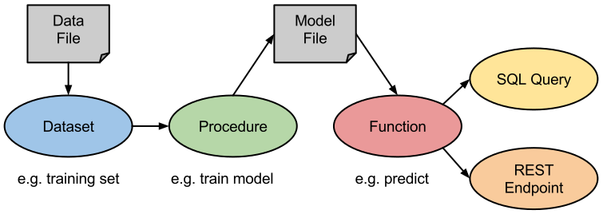
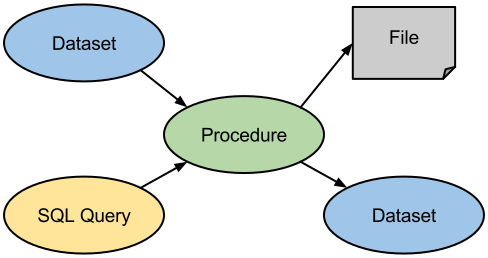
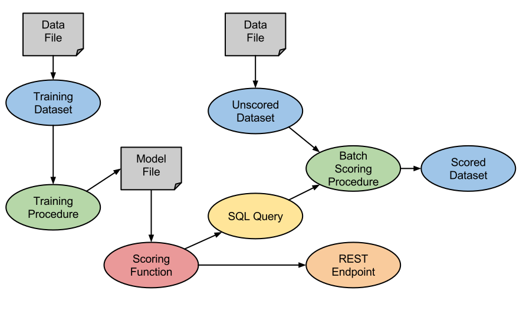

# MLDB Overview

In MLDB, machine learning models are applied using **Functions**, which are parameterized by the output of training **Procedures**, which run over **Datasets** containing training data. Functions are also available to SQL Queries and as REST Endpoints. This document gives an overview of how these concepts work together.

## Functions

Functions are named, reusable programs used to implement streaming computations which can accept arguments and return values. Functions are used to:

* Encapsulate [SQL expressions](sql/Sql.md)
* Apply machine learning models parameterized by the output of a training Procedure

All MLDB Functions are also automatically accessible as [REST Endpoints](functions/Application.md), which can be used to apply machine learning models in a streaming/real-time process. Additionally, [SQL queries](sql/Sql.md) can use Functions to efficiently apply machine learning models to data in a batch process.

MLDB provides a number of built-in Functions types for various use-cases. [Learn more about Functions](functions/Functions.md).

## Procedures

Procedures are named, reusable programs used to implement long-running batch operations with no return values. Procedures generally run over Datasets and can be configured via [SQL expressions](sql/Sql.md). The outputs of a Procedure can include Datasets and files. Procedures are used to:

* Transform or clean up data
* Train machine learning models
* Apply machine models in batch mode

MLDB provides a number of built-in Procedure types for various use-cases. [Learn more about Procedures](procedures/Procedures.md).

## Datasets

Datasets are named sets of data points composed of (row, column, timestamp, value) tuples. Datasets can have millions of named columns and rows, and data points can take on multiple timestamped values which can be numbers or strings. 

Datasets can be loaded from or saved to files, and can serve as the input to Procedures as well as be created by them. And of course, Datasets can be queried via [SQL queries](sql/Sql.md). 

MLDB provides a number of built-in Dataset types for various use-cases.  [Learn more about Datasets](datasets/Datasets.md).

## Files

MLDB gives users full control over where and how data is persisted. Datasets can be saved and loaded from files. Procedures can create files and Functions can load up parameters from files. 

If data is stored in a system such as S3 or HDFS, it is possible to run multiple instances of MLDB so as to distribute computational load. For example, one powerful and expensive machine could handle model training, storing model files on S3, while a load-balanced cluster of smaller, cheaper machines could load these model files and do real-time scoring over HTTP. 

MLDB accesses files via URLs, with various protocols being recognized, such as `file://`, `s3://`,`hdfs://`, `http://` and `https://`. [Learn more about Files and URLs.](Url.md)

## Putting it all together

The diagram above shows how the various abstractions decribed in this document can be used together to solve a machine learning problem.

1. We start with a file full of training data, which is loaded into a Training Dataset.
1. A Training Procedure is run, to produce a Model File
1. The Model File is used to parameterize a Scoring Function
1. This Scoring Function is immediately accessible via a REST Endpoint for real-time scoring
1. The Scoring Function is also immediately accesible via an SQL Query
1. A Batch Scoring Procedure uses SQL to apply the Scoring Function to an Unscored Dataset in batch, producing a Scored Dataset

## A working example

The  Notebook contains a full example of the flow described above.

## See also

- [Datasets] (datasets/Datasets.md)
- [Procedures] (procedures/Procedures.md)
- [Functions] (functions/Functions.md)
- [SQL Queries] (sql/Sql.md)
- [Files and URLs] (Url.md)

