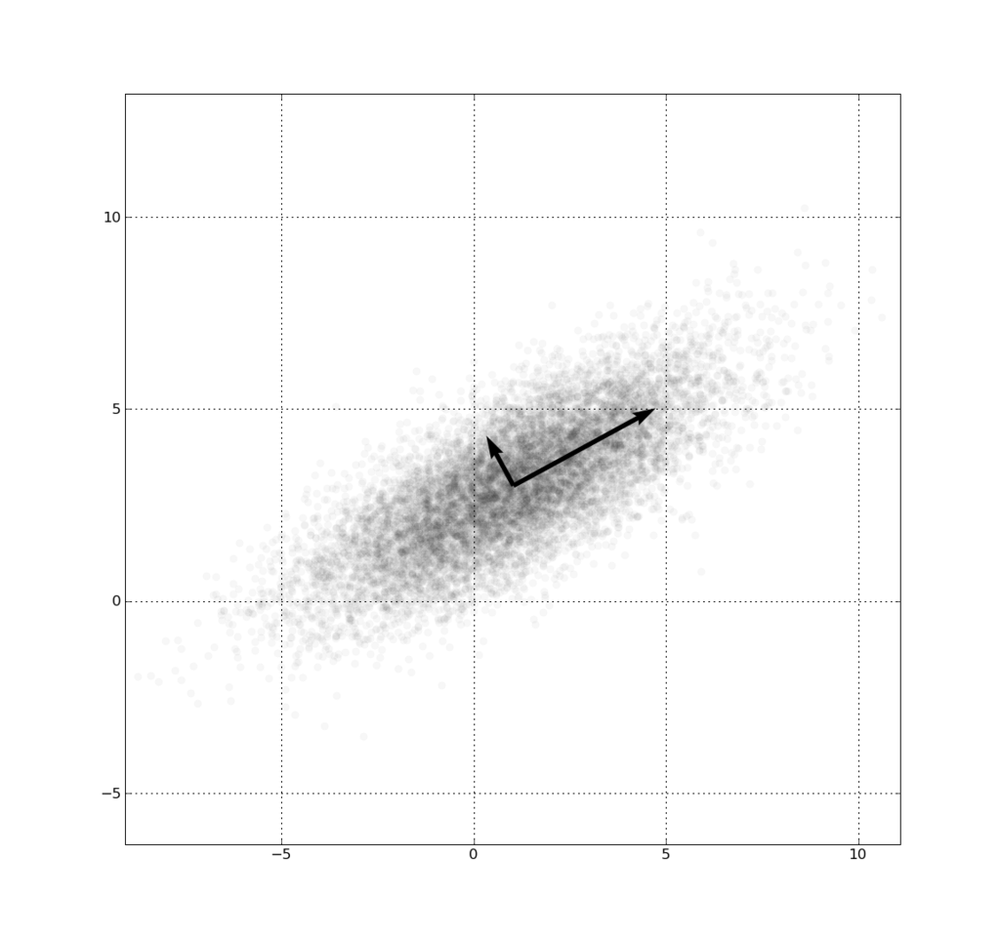

# Gaussian Clustering Training Procedure

This procedure trains an gaussian clustering algorithm and stores the result mixture model (i.e. cluster centroids and covariance matrix) into an output dataset, as well as storing the cluster labels for its input dataset into a separate output dataset.

## Configuration

## Training

The gaussian clustering procedure is a clustering algorithm. It is used to take a set of points, each of which is
characterized by its coordinates in an embedding space, and group them such
that each one belongs to one cluster.  The clusters are described by a gaussian mixture model, i.e. a single
point that is the cluster centroid, as well as a N by N covariance matrix. 

The input dataset has one row per point, with the coordinates being in the
columns. There must be the same set of numeric coordinates per row.

As an example, the following input would be suitable for the EM algorithm:

|  *rowName*   |  *x*  |  *y*  |
|----------|---|---|
| row1     | 1 | 4 |
| row2     | 1 | 3 |
| row3     | 3 | 1 |
| row4     | 4 | 1 |

The gaussian mixture models are evaluated through an estimation-maximization algorithm. This algorithm alternates between assigning,
for each point, a normalized score to each cluster (soft-assigning), and evaluating the parameters of the gaussian mixture using said points and score.
The score is calculated using the multivariate normal distribution density function.

Using the output of the procedure to classify new points is done by selecting the cluster with the highest score.

Because the size of the dense covariance matrix grows to the square of the number of dimensions in the input data, it is strongly 
recommended to use dimensionality reduction to bring the number of input dimensions to 10 or less. This should also improve the accuracy 
of the result, as with most clustering algorithms.

### The Covariance Matrix

This image represents points from a multivariate Gaussian distribution in 2 dimensions. The direction of the arrows correspond to the eigenvectors
of the covariance matrix of the distribution, while their length correspond to the square roots of the eigenvalues. (image source: wikipedia.org)

Using a centroid and a covariance matrix we can thus represent a cluster in N dimensions with a distribution that varies differently through N orthogonal directions
that are not necessarily axis-aligned.

# See also

* the  applies the centroids to new data points to deternine
   which cluster they fit in to.
